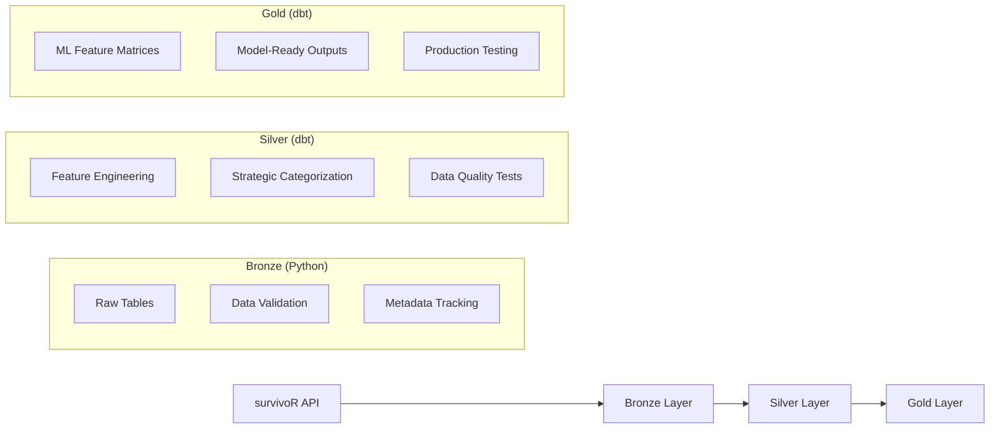

# Architecture Overview

## Gamebot Production Architecture

Gamebot implements a **medallion lakehouse architecture** using Apache Airflow, dbt, and PostgreSQL with production-ready containerized orchestration. The system processes 200,000+ Survivor data points through bronze → silver → gold layers with automated dependency management.

### Core Components

| Component | Purpose | Technology |
|-----------|---------|------------|
| **Orchestration** | Pipeline scheduling and dependency management | Apache Airflow 2.9.1 |
| **Data Processing** | Bronze ingestion and validation | Python + pandas |
| **Transformation** | Silver/Gold feature engineering | dbt 1.10.13 |
| **Storage** | Warehouse database | PostgreSQL 15 |
| **Messaging** | Task queue and result backend | Redis 7 |

### Container Architecture

The production deployment uses Docker Compose with a single `.env` configuration file and automatic context-aware networking:

```yaml
# docker-compose.yaml structure
x-airflow-common: &airflow-common
  build: .                    # Custom Airflow image with dbt
  env_file: [../.env]        # Single configuration source
  environment:
    # Container networking overrides
    DB_HOST: warehouse-db     # Internal container networking
    PORT: "5432"             # Internal PostgreSQL port
    # Airflow-specific configuration
    AIRFLOW__CORE__EXECUTOR: CeleryExecutor
    AIRFLOW__CELERY__BROKER_URL: redis://:@redis:6379/0

services:
  warehouse-db:              # Primary data warehouse
    image: postgres:15
    ports: ["5433:5432"]     # External access via localhost:5433

  airflow-webserver:         # Web interface (localhost:8081)
  airflow-scheduler:         # DAG orchestration
  airflow-worker:            # Task execution (with dbt)
  redis:                     # Message broker
```

### dbt Integration & Permissions

**Container Permissions Solution**: dbt execution in Airflow containers requires writable directories for logs and compilation artifacts:

```bash
# DAG configuration for dbt tasks
mkdir -p /tmp/dbt_logs /tmp/dbt_target
dbt build --log-path /tmp/dbt_logs --target-path /tmp/dbt_target
```

This resolves permission issues that occur when the Airflow user (uid 50000) cannot write to volume-mounted directories owned by the host user (uid 1000).

## Quick Deployment

### Prerequisites

* Docker Engine / Docker Desktop (Compose v2)
* Make (for simplified commands)
* Git

### Production Deployment

1. **Clone and Configure**

   ```bash
   git clone https://github.com/mgrody1/Gamebot.git
   cd Gamebot

   # Create configuration file
   cp .env.example .env
   # Edit .env with your database credentials and settings
   ```

2. **Launch Stack**

   ```bash
   # Initialize and start all services
   make fresh

   # Airflow UI available at http://localhost:8081
   # Default credentials: admin/admin (change in .env)
   ```

3. **Trigger Pipeline**

   Navigate to Airflow UI → DAGs → `survivor_medallion_pipeline` → Trigger

   Or via CLI:
   ```bash
   docker compose exec airflow-scheduler airflow dags trigger survivor_medallion_pipeline
   ```

### Environment Configuration

**Single Configuration File**: The `.env` file provides all necessary settings with automatic context-aware overrides:

```bash
# .env (edit these values)
DB_HOST=localhost              # Overridden to warehouse-db in containers
DB_NAME=survivor_dw_dev
DB_USER=survivor_dev
DB_PASSWORD=your_secure_password
PORT=5433                      # External port, overridden to 5432 in containers
AIRFLOW_PORT=8081              # Web interface port
GAMEBOT_TARGET_LAYER=gold      # Pipeline depth (bronze/silver/gold)
GAMEBOT_DAG_SCHEDULE=0 4 * * 1 # Weekly Monday 4AM UTC
```

**Automatic Context Switching**: Docker Compose automatically overrides database connection parameters for container networking while preserving external access via `localhost:5433`.

### Production Considerations

* **Change default credentials** in `.env` before production use
* **Database persistence** via Docker volumes (survives container restarts)
* **Pipeline scheduling** controlled by `GAMEBOT_DAG_SCHEDULE` environment variable
* **Container networking** isolates services while maintaining external access
* **Rate limiting** enabled by default for Airflow API endpoints

## Development Environment

### Local Development Setup

For contributing to the project or customizing the pipeline:

**Requirements:**
* Docker Engine / Docker Desktop (Compose v2)
* Make (GNU make)
* Git
* Optional: Python 3.11 + Pipenv (for local dbt development)

### Development Workflow

**1. Environment Setup**

```bash
git clone https://github.com/mgrody1/Gamebot.git
cd Gamebot

# Create development configuration
cp .env.example .env
# Edit .env for local development settings
```

**2. Container-Based Development (Recommended)**

```bash
# Start complete stack
make fresh

# Access services
# - Airflow UI: http://localhost:8081
# - Database: localhost:5433
# - All source code is volume-mounted for live editing
```

**3. Local Python Development (Optional)**

For direct dbt development or debugging:

```bash
# Install dependencies
pip install pipenv
pipenv install

# Test dbt locally (requires running database)
pipenv run dbt debug --project-dir dbt --profiles-dir dbt
pipenv run dbt run --project-dir dbt --profiles-dir dbt --select silver
```

### Key Development Features

**Live Code Reloading**: Source code directories are volume-mounted into containers:
- `dbt/`: dbt models and tests
- `airflow/dags/`: Airflow DAG definitions
- `Database/`: Python ingestion modules
- `gamebot_core/`: Core utilities

**Database Access**: Connect with any PostgreSQL client:
- Host: `localhost`, Port: `5433`
- Credentials from `.env` file

**Container Networking**: Internal services use container names (`warehouse-db:5432`) while external access uses `localhost:5433`

### Development Commands

```bash
# Stack management
make fresh          # Clean start (builds images, initializes DB)
make up            # Start existing stack
make down          # Stop stack (keep data)
make clean         # Remove everything (data included)
make logs          # Follow service logs
make ps            # Show service status

# Pipeline testing
make loader        # Run bronze ingestion manually
docker compose exec airflow-scheduler airflow dags trigger survivor_medallion_pipeline

# Development utilities
docker compose exec airflow-worker bash    # Shell access
docker compose exec warehouse-db psql -U survivor_dev survivor_dw_dev  # Database access
```

### VS Code Development

The repository includes VS Code development container configuration for consistent development environments:

1. Install VS Code + "Dev Containers" extension
2. Open repository in VS Code
3. Command Palette → "Dev Containers: Reopen in Container"
4. Container provides Python 3.11, pipenv, and all dependencies

### dbt Development Best Practices

**Container Permissions**: When developing dbt models, use writable directories:

```bash
# In container or local development
mkdir -p /tmp/dbt_logs /tmp/dbt_target
dbt run --project-dir dbt --profiles-dir dbt --log-path /tmp/dbt_logs --target-path /tmp/dbt_target
```

**Testing**: Run comprehensive tests:
```bash
dbt test --project-dir dbt --profiles-dir dbt    # Data quality tests
dbt build --project-dir dbt --profiles-dir dbt   # Build + test
```

---

## Pipeline Architecture Deep Dive

### Medallion Data Flow

The pipeline implements a strict **bronze → silver → gold** progression with automated dependency management:



### Data Layer Details

**Bronze Layer (21 tables, 193,000+ records)**
- Raw survivoR dataset ingestion with Python + pandas
- Comprehensive data validation and cleaning
- Metadata tracking for data lineage and versioning
- Example: `advantage_details`, `castaway_details`, `vote_history`

**Silver Layer (8 tables, 9 tests)**
- Strategic gameplay feature engineering with dbt
- Categorized by analysis domain (challenges, social dynamics, voting patterns)
- Data quality tests ensuring referential integrity
- Example: `castaway_profile`, `challenge_performance`, `vote_dynamics`

**Gold Layer (2 tables, 4 tests)**
- ML-ready feature matrices optimized for different modeling approaches
- `ml_features_hybrid`: Combines gameplay + edit/narrative features
- `ml_features_non_edit`: Pure gameplay features only
- 4,248 observations per table (one row per castaway-season)### Technical Implementation

**Container Orchestration**: Apache Airflow 2.9.1 with Celery executor
**Data Processing**: Custom Python modules + dbt 1.10.13
**Storage**: PostgreSQL 15 with automatic schema management
**Networking**: Docker Compose with automatic context-aware connection handling
**Dependencies**: Automated DAG orchestration with proper task sequencing

The architecture successfully processes the complete Survivor dataset with production-ready validation, testing, and ML feature preparation.

### Quick start (Docker + Makefile)

> Commands use standard POSIX syntax and work on macOS, Linux, and Windows (PowerShell or Git Bash). Substitute paths as needed for your environment.

This is the fastest way to spin up Airflow, Postgres, and Redis. It also creates the Airflow admin user.

1. **Clone the repo**

   ```bash
   git clone https://github.com/mgrody1/Gamebot.git
   cd Gamebot   # repository folder name
   ```

2. **Create `.env`**

   ```bash
   pipenv run python scripts/setup_env.py dev --from-template
   ```

   The script will create `.env` if it doesn’t exist, fill in missing values from `env/.env.dev.example`, preserve any existing shared secrets, and sync everything to `airflow/.env`.
   Run this command inside the Dev Container **or** on the host after you have installed Pipenv.

3. **Start the stack**

   ```bash
   make up
   ```

   This runs `docker compose up airflow-init` and then `docker compose up -d` from the `airflow/` directory. It starts:

   * `warehouse-db` – Gamebot warehouse Postgres
   * `postgres` – Airflow metadata database
   * `redis` – Celery broker/result backend
   * Airflow webserver / scheduler / worker / triggerer

4. **Open Airflow**

   * URL: `http://localhost:${AIRFLOW_PORT:-8080}` (set `AIRFLOW_PORT` in `.env` if you need another port)
   * Login: `admin / admin`

5. **Trigger the DAG**

   * UI: Unpause and trigger `survivor_medallion_dag`
   * CLI (from `airflow/`):

     ```bash
     docker compose exec airflow-scheduler airflow dags trigger survivor_medallion_dag
     ```

#### Handy Make targets

```bash
make up           # start/initialize Airflow + Postgres + Redis
make down         # stop the stack (keeps volumes)
make clean        # stop and remove volumes (fresh start)
make logs         # follow scheduler logs
make ps           # list services and status
make loader       # run the on-demand bronze loader (profile) container
```

Notes:

* `make up` is idempotent—it handles Airflow DB migrations and creates the `admin` user if missing.
* If another process is bound to `8080`, set `AIRFLOW_PORT=8081` (or any free port) in `.env`.

### Dev Container workflow (recommended for development)

> Reference: [VS Code Dev Containers documentation](https://code.visualstudio.com/docs/devcontainers/containers).

Use VS Code **Dev Containers** to avoid managing Python locally.

1. Install VS Code + “Dev Containers” extension.
2. Open the repo in VS Code. Use the Command Palette (`Ctrl/⌘` + `Shift` + `P`) → **Dev Containers: Reopen in Container**.
3. When the container attaches, the repo is mounted at `/workspace` with Python 3.11, Pipenv, and the `gamebot` Jupyter kernel preconfigured (select it from the kernel picker if VS Code prompts).
4. Run orchestration (`make up`, `make down`, etc.) from the **host** terminal. Use the Dev Container terminal for Python/dbt commands (`pipenv run ...`) once the stack is up.
5. Pre-commit hooks are installed automatically during container creation (see `.devcontainer/devcontainer.json`). If you modify the hook set later, rerun `pipenv run pre-commit install`.

> Tip: Keep one host terminal for Docker/Make commands and a Dev Container terminal for `pipenv run ...`. You don’t need a host Python install if you work entirely inside the container.

> Notebook workflow: See [CONTRIBUTING.md](../CONTRIBUTING.md) for how Jupytext keeps notebooks and scripts in sync (pairing commands, VS Code task, pre-commit integration). The write-up references [this tutorial](https://bielsnohr.github.io/2024/03/04/jupyter-notebook-scripts-jupytext-vscode.html) if you want more context.

### Local Pipenv workflow (alternative)

Run development locally with your own Python while still using the Dockerised Airflow/Postgres, or run everything locally.

1. Install dependencies

   ```bash
   pip install pipenv
   pipenv install
   ```

2. Select an environment and create `.env`

   ```bash
   pipenv run python scripts/setup_env.py dev --from-template
   # edit .env if you prefer different DB host/name; use DB_HOST=warehouse-db to target the Docker Postgres
   ```

3. Start orchestration with Docker (recommended even for local Pipenv)

   ```bash
   make up
   # Airflow UI at http://localhost:${AIRFLOW_PORT}
   ```

4. Produce a bronze load from Python (optional if you rely solely on the Airflow DAG)

   ```bash
   pipenv run python -m Database.load_survivor_data
   ```

5. Run transformations locally (dbt)

   ```bash
   pipenv run dbt deps --project-dir dbt --profiles-dir dbt
   pipenv run dbt build --project-dir dbt --profiles-dir dbt --select silver
   pipenv run dbt build --project-dir dbt --profiles-dir dbt --select gold
   ```

6. Optional: Run everything locally without Docker

   * Provide your own Postgres 15+ credentials in `.env` (not `warehouse-db`)
   * Use `pipenv run python -m Database.load_survivor_data` for bronze
   * Run dbt as above
   * Skip `make up` and Airflow entirely if you don’t need scheduling

---

## gamebot-lite (analyst package)

```bash
pip install --upgrade gamebot-lite
```

```python
from gamebot_lite import load_table, duckdb_query
df = load_table("vote_history_curated")
```

See [gamebot_lite.md](gamebot_lite.md) for table inventories (bronze/silver/gold), sample queries, and packaging workflow.
